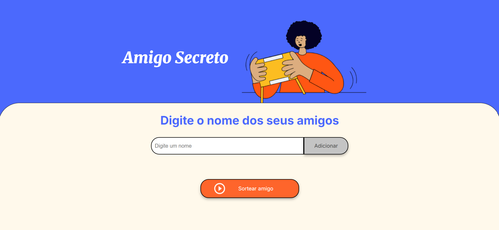

# 🎁 Amigo Secreto

Este projeto foi desenvolvido durante um curso de **JavaScript** para reforçar conceitos básicos de manipulação do DOM, arrays e eventos. A aplicação permite que o usuário cadastre nomes em uma lista e, ao final, realize um sorteio para descobrir quem será o **amigo secreto**.

---

## 🚀 Funcionalidades

- ✍️ **Adicionar nomes**: insira o nome de um amigo no campo de texto e clique em **Adicionar**.  
- ✅ **Validação de entrada**: impede que nomes vazios sejam adicionados, exibindo um alerta caso isso ocorra.  
- 📋 **Visualização da lista**: todos os nomes inseridos aparecem em uma lista na tela.  
- 🎲 **Sorteio aleatório**: ao clicar no botão **Sortear Amigo**, um dos nomes cadastrados será escolhido aleatoriamente e exibido na tela.

---

## 🛠️ Tecnologias utilizadas

- **HTML5**
- **CSS3**
- **JavaScript**

---

## 📸 Demonstração

> Aqui está o projeto em ação



---

## 📂 Estrutura do projeto

```bash
challenge-amigo-secreto/
│── assets
│── index.html
│── style.css
│── script.js
└── README.md
```

---

## 📖 Como executar

1. Clone este repositório:
   ```bash
   git clone https://github.com/leonardobe/challenge-amigo-secreto.git
   ```
2. Acesse a pasta do projeto:
   ```bash
   cd challenge-amigo-secreto
   ```
3. Abra o arquivo `index.html` em seu navegador.  

---

## 🎯 Aprendizados

Durante o desenvolvimento, foi possível praticar:
- Manipulação de elementos do DOM.
- Uso de `Math.random()` e `Math.floor()` para geração de valores aleatórios.
- Boas práticas com funções simples e validações de entrada.

---

## 📜 Licença

Este projeto foi feito apenas para fins de estudo. Sinta-se à vontade para usar e modificar. 🚀
